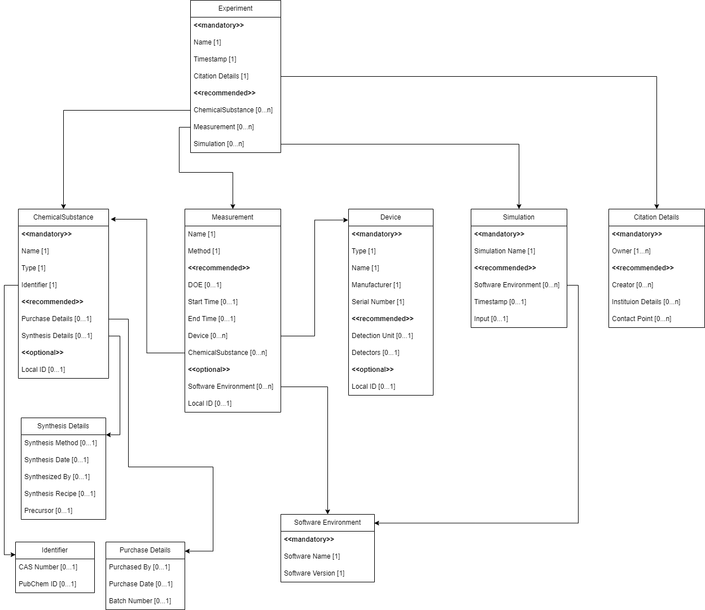

# A metadata collection for catalysis-related sciences for integration into Dataverse

> **The first collection of fields was simmarized in June 2024.**
> **Our goal is to grow refine the collection to cover all subdisciplines of catalysis.**
> **Please join if you like to help.**

The metadat collection has been created and maintained as part of the [NFDI4Cat](http://nfdi4cat.org) initiative.

A collection of metadata was compiled as part of the application and expansion of a [Dataverse](https://dataverse.org/) repository in the NFDI4Cat project. This collection results from a series of different use cases that cover a large part of the various disciplines within catalysis research. The aim of the collection is to summarise the most important properties that are necessary for the basic description of essential aspects of the data.

Based on this collection, a TSV file was created that is meant to be integrated into a Dataverse instance as a metadata block and thus enables the use of additional metadata fields. For more information, see [Metadata Customization](https://guides.dataverse.org/en/latest/admin/metadatacustomization.html)

the aim is to add semantic representation to the metadata so that the stored data and metadata follow the FAIR principles and are machine-readable.

### Disclaimer
Since a large part of the defined metadata from the collection does not yet have a corresponding semantic representation, such a representation is not provided within the TSV file. This is part of the current development and we appreciate any support. Furthermore, the complex relations of the defined metadata collection (as seen in the picture) cannot be implemented by Dataverse, so that a partial decoupling of these fields into numerous metadata blocks was necessary.

## Basic project content
* Overall collection of important metadata fields
* Directory containing TSV files defining metadata blocks for Dataverse
* Visual representation of metadata blocks and their relation for Dataverse

## Acknowledgement

This work was funded by the German Research Foundation (DFG) through the project "[NFDI4Cat](https://nfdi4cat.org) - NFDI for Catalysis-Related Sciences" (DFG project no. [441926934](https://gepris.dfg.de/gepris/projekt/441926934)), within the National Research Data Infrastructure ([NFDI](https://www.nfdi.de)) programme of the Joint Science Conference (GWK).